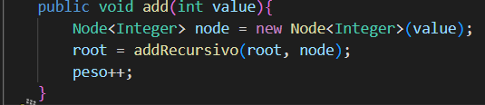

# Práctica: Estructuras No lineales 

## Datos del Estudiante
- **Nombre:** Miguel Maza
- **Curso:** Computacion grupo 1
- **Fecha:** 16- 06-2026

---
## 1. Implementación del metodo recursivo en la clase IntTree

**Fecha:** 16/6/2026

**Descripción:** En esta practica se implemento el metodo recursivo que nos permite insertar numeros , si el numero es menor a la raiz se inserta a la izquierda y si es mayor a la derecha.

**Metodo add**

**Metodo recursivo**

## 2. Impresion del arbol en recorridos Pre-Orden , Pos-Orden , in-Orden el peso y altura.

**Fecha:** 19/6/2026

**Descripción:** Se implemento los metodos recursivos para la impresion de recorridos de arboles binarios, ademas se implemento un arbol de personas.

**Pre- Orden**

**Pos- Orden**

**In - Orden**

**Altura**

**Peso**

**Insercion de personas**

**Impresion en consola**

**Impresion del arboles de personas**

